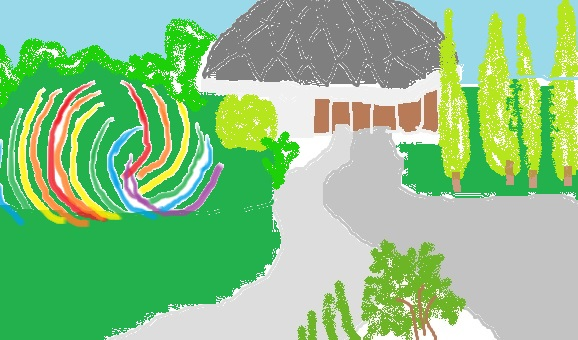

Greater Des Moines Botanical Garden
===================================

About
------
In 1929 a public garden in Des Moines was first formed. After the stock market 
crash, it was hard to make any progress on this tiny garden. However, a Friends 
organization started in 1969, which is what is now known as the Des Moines 
Botanical Center, which finally opened in 1979. This garden was run by the City 
of Des Moines Parks and Recreation Department. In 2004 it changed management to 
the Des Moines Water Works, which renamed it to the Des Moines Botanical and 
Environmental Center. However, that management ended in 2012 and it is now a 
nonprofit organization and titled Greater Des Moines Botanical Garden.

What's Inside
--------------
| **Indoor Gardens**
| The consevatory has been in the Botanical Gardens since its opening in 1979. It 
  contains the Desert Garden, which features cacti and other succulents. The topical 
  plantings contain a star fruit tree, a tapeworm plant, a chenille plant, and the 
  traveler's palm. There are a couple art pieces displayed as well - "Iowa 
  Wildflowers" and a trowel by local artist, Jon Hrabe. There is a waterfall along 
  with Koi included in this indoor garden.
|
| **Outdoor Gardens**
| There are many gardens including the Hillside Garden, the Water Garden, and the 
  Conifer Garden. The Hillside Garden contains four of the five original tree 
  standing on the first seven acres of the property. It also contains other trees 
  and shrubs, lilacs, smooth hydrangeas, and in the Spring it contains daffodils, 
  squill, and Spanish bluebells. The half-acre water garden contains three islands 
  of seasonal plants, water lillies, Japanese water irises, copper irises, and 
  other aquatic perennials. The Dorothy and Max Rutledge Conifer Garden is a dry 
  garden. There are plants rooted in gravel such as the native little bluestem, 
  Eruasian blubs, wisteria flowers, cacti, conifers, and orchids.

Contact Information
---------------------
| Location: 909 Robert D. Ray Drive Des Moines, IA 50309
| Hours: 10 A.M. - 5 P.M.
| Phone Number: (515)323-6290
|
| `Visit the Botanical Garden Webpage`_ 
.. _Visit the Botanical Garden Webpage: http://www.dmbotanicalgarden.com/

