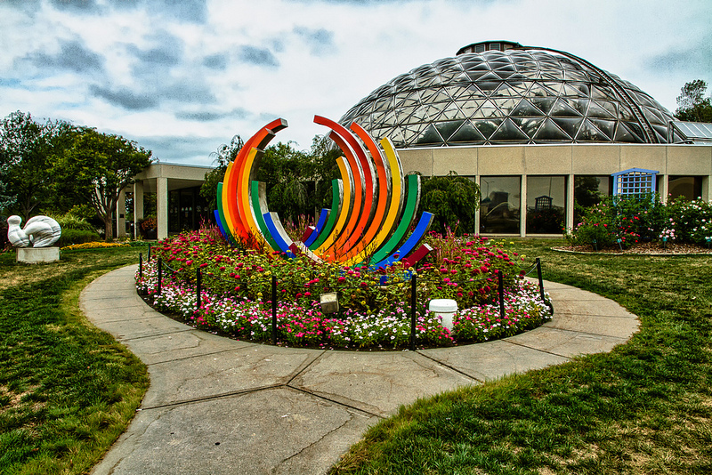

Botanical Gardens
=================

What's Inside?
--------------
| **Conservatory**
| The consevatory is full of ________.
|
| **Water Education Garden**
| Here is where you can explore.

Buck Rose Garden
""""""""""""""""""

Scupture/Water Feature
"""""""""""""""""""""""

Tree Grove Walk
""""""""""""""""

Hillside Sun Garden
""""""""""""""""""""
Pergola Terrace
""""""""""""""""

Contact
--------
| Location: 909 Robert D. Ray Drive Des Moines, IA 50309
| Hours: 10 A.M. - 5 P.M.
| Phone Number: (515)323-6290
|
| `Visit the Webpage`_ 
.. _Visit the Webpage: http://www.dmbotanicalgarden.com/

