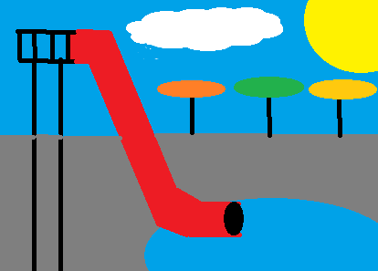

King's Pointe
=============

About
-----

King's Pointe is a vacation destination for the whole family to enjoy. This waterpark resort is one of the best in the Midwest and overlooks beautiful Storm Lake. The waterpark is open year round due to an outdoor and indoor facility for the kids to enjoy the park fun anytime of the year. This facility was recently built around 2004 and has been a growing resort ever since. 

Activities
----------

Getting sick of the indoor/outdoor pool? Check out the other activities that Storm Lake has to offer to its generous guests.

 | **AWAYSIS Lighthouse**
 | Visitors can get a birds-eye view of Storm Lake when they climb to the top of this lighthouse located right off the shore of Storm Lake.

 | **Harker House**
 | Built in 1875, this house allows visitors to step back in time with a guided tour of the home.

 | **Sunrise Pointe Golf Course**
 | Adjacent to the resort, this 9-hole golf course offers wide fairways and challenging game play in a lovely setting.

 | **Storm Lake Hike and Bike Trail**
 | This trail stretches for five miles along the edges of Storm Lake. It is a wide, paved path that goes under shady trees and past lovely parks for the kids to enjoy. And if you want to ride bikes along this path, King's Pointe Resort has you covered with bike rentals.

 | **AWAYSIS Great Lawn**
 | Located next to the resort, the AWAYSIS Great Lawn is host to concerts, festivals, fireworks and other special events. The Great Lawn is also available for public use, offering a great expanse of lawn for which the kids can run and play.

Contact Information
-------------------

 | 1520 East Lakeshore Drive Storm Lake, Iowa 50588
 | Hours: 8-6 
 | Phone: 712.213.4500
 | Toll Free: 866.552.5960

 Start your getaway off right with `King's Pointe Waterpark Resort <http://www.kingspointeresort.com//>`_. 