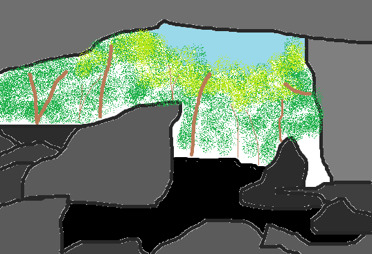

Maquoketa Caves State Park
==========================

About
------
Maquoketa Caves area has been a popular spot for hundreds, maybe even thousands 
of years as the artifacts point out. There has been artifacts such as pottery, 
tools, and projectile points made of stone have been found in the caves and the 
surrounding areas. The caves were first discovered by settlers in the 1830's. 
The first park land was purchased in 1921, while most of the facilities were 
not constructed until the 1930's. The park contains more caves than any other 
state park in Iowa. Stlactites used to hang from the ceilings and stalagmites 
rose from the floor. When souvenir hunters came through the caves many years ago, 
some of the formations were destroyed, but many still remain. At Maquoketa Caves 
State Park, there is an assortment of activities to engage in, such as camping 
and hiking.

Things to Do
------------
| **Trails**
| There are 6 miles of trails. The Eastern part contains the access to 
  facilities and the caves. Some caves can be explored while walking, while 
  others must be explored while crawling. A hiker will be able to see sites 
  such as the "Natural Bridge", which stands almost 50 feet above Racoon 
  Creek, a 17-ton "Balanced Rock", and "Dancehill Cave". The western trail takes 
  hikers to a restored prarie, oak savanna restoration, and a wildlife food plot.
|
| **Camping**
| There are 29 campsites, along with a picnic area and a children's playground. 
  Seventeen of the campsites include electricity and there are also shower 
  facilities provided. There are two picnic shelthers that can be reserved. 
  This would be a great getaway if you are looking for a new place to enjoy 
  nature and some fresh scenery.

Contact
---------
| Location: 10970 98th St, Maquoketa, IA 52060
| Hours: 4:30 A.M. - 10:00 P.M.
| Phone Number: (563)652-5833
| 
| `Visit the Maquoketa Caves Webpage`_ 
.. _Visit the Maquoketa Caves Webpage: http://www.iowadnr.gov/Places-to-Go/State-Parks-Rec-Areas/Iowas-State-Parks/ParkDetails/ParkID/610127

